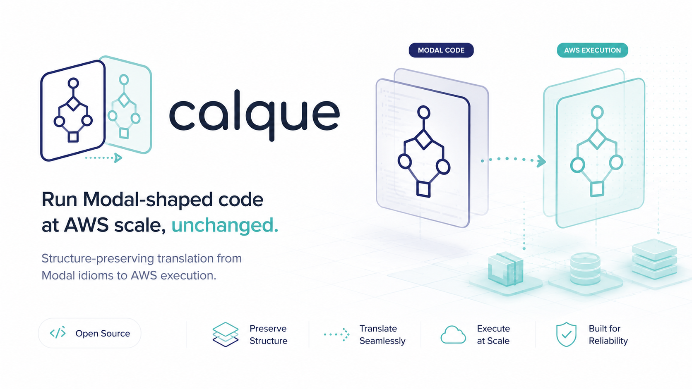

# calque



**Run Modal-shaped code at AWS scale, unchanged.**

Modal is where inference/batch code is *prototyped* — great inner loop, pay-nothing-when-idle.
AWS is where the same code *scales* — you own the rectangle and the economics flip at volume.
calque is the loan-translation between the two: the same script that ran over 10 items on Modal
runs over 10,000,000 on AWS **without a logic rewrite** (only a mechanical `gpu=` substitution).

**The thesis:** groups hit cases where Modal doesn't scale for them — capacity, cost at
volume, control — and need an unchanged migration path off it. calque is that path: it
widens its supported Modal-idiom surface toward real-world scripts (not a fixed test
corpus), and for anything it doesn't yet support, it says so loudly (a structured leak)
rather than silently dropping semantics or crashing mysteriously. See the capability
matrix below for exactly where that frontier is today.

> A *calque* is a structure-preserving translation between languages (English "flea market" ←
> French *marché aux puces*). That is the job: translate Modal's idioms onto AWS term-by-term,
> structure intact, so the author doesn't notice the translation.

**This is a spike.** It exists to prove one thing and fake everything else:

- **Prove:** the plumbing carries Modal's semantics onto AWS — a real Modal script's decorators,
  execution shape, and payload code run unchanged against real AWS hardware.
- **Fake behind the seam:** all card-selection / cost-optimization intelligence. The recommender
  is a plumbing pass-through, not a decision — it carries the script's own requested card through
  unchanged, falling back to one constant (`RTX PRO 6000`) only when the script declares no `gpu=`
  at all. No real phase-detection, right-sizing, or cost/latency optimization exists behind the
  interface (calque#134). See `internal/target`.

## Quick start (zero spend)

Everything here runs locally and **launches no AWS GPU** — no credentials required.

**Prerequisites:** [`uv`](https://docs.astral.sh/uv/) either way. AWS credentials are needed
only for real (billable) runs, not for anything below.

**Install a release** (macOS / Linux via Homebrew, Windows via Scoop — sets `CALQUE_PYAST_DIR`
automatically):

```bash
brew install spore-host/tap/calque
```
```powershell
scoop bucket add spore-host https://github.com/spore-host/scoop-bucket
scoop install calque
```

**Or build from source** (also needs Go 1.26, matching `go.mod`):

```
git clone https://github.com/spore-host/calque && cd calque
go build -o calque ./cmd/calque      # control plane
(cd tools/pyast && uv sync)          # Python AST helper deps
```

**Analyze a Modal script** (static passes — GPU-swap legality, Bedrock gate, leaks):

```
./calque analyze examples/map_batch_inference.py
```

```
  gpu[Batcher]: clean_swap requested="H100" -> RTX PRO 6000 (single-card, no coupling signal; memory-bound B=1 substitution is legal)
  volume: "weights" -> volumes/weights/ (mount /weights, delta-sync => warm-cache reuse)
...
--- leak report (§10) ---
LEAKS: 1 emitted across 1 primitives
```

**Run the full pipeline locally** (dry-run — the default, no AWS spend):

```
./calque run --n 100 --dry-run examples/map_batch_inference.py
```

```
[DRY-RUN] not launching a billable instance; driving warm worker locally on a synthetic sample
[DRY-RUN] warm unit ran 50 items, 0 failed; @enter x1 (0.305s), mean 0.0542s/item
...
--- leak report (§10) ---
LEAKS: 3 emitted across 3 primitives
```

`calque run --dry-run` always executes the picked unit's body via `uv run`, never the
ambient shell's own `python3`/site-packages — so you never need to `pip install` a
script's own third-party dependencies (e.g. `modal`, `google-cloud-storage`,
`earth2studio`) locally first. calque injects them into `uv`'s ephemeral environment
per invocation, using the exact `pip_install(...)`/`uv_pip_install(...)` packages its
own `.image` chain already declares (plus `modal` itself, unconditionally, since a real
script's body routinely references `modal.Secret`/`modal.Volume` directly even when
Modal's own SDK isn't itself a declared dependency). Set `CALQUE_PYTHON=/path/to/python3`
to bypass `uv` entirely and point dry-run at a specific interpreter instead.

That's the whole idea in two commands: a mechanical `gpu=` swap, then every pipeline stage
running end to end against the unchanged script — parse, gate, plan, warm-execute, collect.
See [`examples/`](examples/) for seven annotated journeys (analyze, dry-run, Bedrock
route-away, an unsupported-workload refusal, Volume-cached reuse, a permanent
non-goal honestly leaked, and a real billable AWS run), each with real output.

**Ready to run something for real?** [`docs/guide/getting-started.md`](docs/guide/getting-started.md)
picks up exactly where this section leaves off — smoke test, first real (billable) AWS
run, then driving your own script's own real body on real hardware.

> **Notes.** `analyze`/`run` reach two best-effort network sources (the Bedrock
> catalog and the `hf-bedrock-map` API); offline they print a `warn:` line and fall
> back — a networkless run is not a failure. The binary finds the Python helper
> relative to the repo; to run a copied/`go install`ed binary out of tree, set
> `CALQUE_PYAST_DIR` to the `tools/pyast` path.

## Status

Experimental, versioned releases shipping — see the
[latest release](https://github.com/spore-host/calque/releases/latest) (packaged installs via
Homebrew/Scoop). Tracking lives on GitHub (Issues / Projects / milestones), not local files.
**Phase 2 (Modal-idiom porting, milestones M5–M10) is merged.**

The single most direct answer to "does calque support my script" is
[`docs/modal-compatibility-matrix.md`](docs/modal-compatibility-matrix.md) — a
construct-by-construct census against Modal's real API surface and a corpus of
real-world usage, not a hand-picked list. Everything not yet supported is either
recognized-and-leaked (detected, explained, never silently dropped) or tracked as an
open gap; see [`docs/behind-the-seam-register.md`](docs/behind-the-seam-register.md)
for the deliberate non-goals.

Verification below is layered — offline (unit-tested, no spend), live (run on a real
acquired GPU), and at scale (larger N, more instances). The matrix reads them apart:

| Capability | Offline tested | Live verified | Scale verified |
|---|---|---|---|
| Parse → IR, leak reporting | ✅ | n/a | ✅ corpus census |
| `gpu=` swap guard (§7) | ✅ | ✅ | ✅ corpus |
| Bedrock gate + route-away (§11) | ✅ | ✅ (live catalog) | n/a |
| Idiom pass-through (§C) | ✅ | n/a | n/a |
| Single-instance warm run (§6) | ✅ | ✅ (L4 + RTX PRO 6000, Qwen2.5-1.5B) | ✅ N=1000 |
| Volume sync + commit write-back (§3/§15) | ✅ | ✅ (sync) | — |
| Multi-instance `.map()` fan-out (§15) | ✅ | ⏳ pending capacity | ⏳ pending N=100k ([#18](https://github.com/spore-host/calque/issues/18)) |
| Serve entrypoints (§F) | detect + leak only | ❌ not built | ❌ |

✅ done · ⏳ blocked/pending · ❌ deliberately not built (see `docs/behind-the-seam-register.md`).

The per-capability detail follows; nothing is removed, only sequenced under the matrix.

**Built, tested, and verified (no spend):**
- `parse → IR → seam` — pyast helper, six-primitive IR, `StubRecommender` (constant behind an interface).
- **Bedrock gate + route-away** (§11) — live catalog, `exact`/`near`/`none` tiers, proven in both
  directions. A model that's already an exact Bedrock API call yields a structured `ReplacementOffer`
  (Bedrock `modelId` + region invoke hint) and **short-circuits the runnable path *before* a GPU is
  acquired** — renting a GPU for a served model is the wrong answer. Near matches surface as candidates
  to verify, with the axes of difference and *no* quality claim (exact-match discipline).
- **`gpu=` guard** (§7) — clean-swap vs multi-GPU/coupled flags, adversarial fixture.
- **idiom pass-through** (§C) — image verbs (incl. `from_aws_ecr`); portable kwargs (`cpu=`/`memory=`
  recorded-not-acted behind the seam, `retries=` wired to the warm supervisor); synchronous invocation
  kinds `.map`/`.starmap`/`.for_each`/`.remote`; `.map.aio` recognized-and-leaked; `.spawn()`+`.get()`
  block-and-wait fan-out has a real driver (`calque spawn-run`), live-verified on real AWS.
- **warm worker** (`warmd` + `runner.py`, §6) — `@enter` once, crash-restart re-drive, partial-failure.
- **plan** (§5) — truffle resolve+price, `Acquirer` as a thin adapter over
  `lagotto/pkg/snipe.Snipe` (AZ-sweep, capacity retry/backoff, deadline).
- **image / exec** — Dockerfile+digest cache; S3 sink/collector; on-instance `warmd` entrypoint.
- **volumes** (§3/§15) — `Volume.from_name` → stable S3 prefix, delta-synced to the mount path
  before `@enter` (warm-cache reuse; image/volume separation). `volume.commit()` persists as an
  **end-of-run write-back** (reverse S3 sync after `@method` drains); mid-run `.reload()`/`.commit()`
  is leaked as a semantic gap the spike doesn't reproduce.
- **multi-instance `.map` fan-out** (§15) — shard N items across S single-node instances acquired **in
  parallel**, drive each shard's `warmd` independently, collect the **union** back into one globally
  ordered result set + one global `missing[]`, re-drive a dead shard once. Embarrassingly parallel
  across independent boxes — *not* §1's forbidden multi-node/gang scheduling. Core is unit-tested
  offline; `calque real --shards N` wires it.
- **serve entrypoints** (§F) — `@web_endpoint`/`@asgi_app`/`@wsgi_app` are **detected and leaked** as a
  deferred shape (batch is the shape the spike runs); a served *Bedrock* model still routes away. The
  long-lived server is not built — see `docs/serve-architecture.md`.
- **full pipeline** — `calque run --dry-run` runs every stage locally; `calque ramp` acquires one
  GPU and runs an N-ramp on it; `calque real --shards N` fans out across a fleet.

**Real inference, verified on live GPUs.** Getting real inference end-to-end surfaced
five genuine deployment findings, each caught fast and fixed: worker dir `/opt`→`/tmp`,
docker needs `sudo`, IMDSv2 hop-limit 2 for container creds, 200 GiB root volume for the
vLLM image, and vLLM's stdout logs colliding with the warm-worker JSON protocol (the §6
"socket draws blood" edge — now isolated + regression-tested).

**Corpus census (§16.4)** across the test scripts: Bedrock 1 exact-eligible / 1 self-hosted / 4
identity-hidden; gpu guard 4 clean-swaps / 1 multi-GPU flag / 1 coupled flag / 1 no-gpu.

## Pipeline

```
script.py
 └─ parse      decorators → IR         (shallow AST; bodies extracted verbatim)
   └─ gate     Bedrock exact match?    (route away: print offer & stop BEFORE any GPU)
     └─ recommend  IR → Target         (STUB: constant behind Recommender interface)
       └─ plan   truffle: Card → candidate g7e instances (+ live price)
                 acquire: block-and-wait via lagotto/pkg/snipe.Snipe (AZ-sweep, retry/backoff)
                 image:   .image DSL → Dockerfile → ECR (cache by digest)
         └─ exec   spawn.Provision launches + brings up the instance(s)
                   [worker] warmd supervises warm Python: @enter once, drain → S3
                   [--shards N] shard items → N instances in parallel → union collect
           └─ collect   gather from S3, ordered by GLOBAL input index (+ global missing[])
             └─ measure per-item cost + occupancy (tach hook)
               └─ report leaks
```

The Go control plane understands **decorators** (configuration). It does **not** parse function
**bodies** (payload) — those ship to the worker verbatim and run under Python exactly as on Modal.

> **Acquisition seam**: `spawn.Provision` *owns* `RunInstances` (acquire + bring-up in one shot).
> The block-and-wait retry/backoff/AZ-sweep loop calque needs on top of that now lives in
> `lagotto/pkg/snipe.Snipe` — `internal/plan.Acquirer` is a thin adapter over it, not the owner of
> that logic itself (a deliberate migration off a hand-rolled local copy, lagotto#106).

## CLI

- **`calque analyze <script.py>`** — static passes only (parse, `gpu=` guard, Bedrock
  gate, leak report). Zero AWS calls, zero cost.
- **`calque run <script.py>`** — the full pipeline, driven locally against a synthetic
  sample (`--dry-run`, the default — never launches a billable instance).
- **`calque smoke`** — the first billable action: an acquire-only de-risking test
  (acquire → bring up → run a trivial job → collect → terminate) before trusting the
  plumbing with real inference.
- **`calque real`** — real inference/compute on acquired hardware — a single instance,
  or `--shards N` to fan out across a fleet. `--script your_app.py` drives that
  script's own real body (not a stand-in), with flags for whatever its real signature
  needs (`--function`, `--secret`, `--item-file`/`--arg-file`/`--arg-json`, `--pip`,
  `--stage-file`, ...).
- **`calque ramp`** — acquire one instance patiently, hold it, run an N-item ramp
  across it over SSM (efficient repeated-N testing without re-paying acquisition).
- **`calque pool`** — a warm, shared model pool that survives across separate runs/claims.
- **`calque spawn-run`** — block-and-wait fan-out for a script using Modal's
  `.spawn()`/`.get()` idiom.
- **`calque session`** — check a MIG slice or MPS client-slot in/out on an
  already-running instance (institutional multi-tenancy).

`smoke`/`real`/`ramp`/`pool create`/`pool scale`/`spawn-run` acquire billable AWS
hardware and refuse to run without an explicit `--i-understand-this-spends-money`
flag. The route-away gate runs on `run`/`real`/`ramp` too: if the model is already an
exact Bedrock API call, calque prints the offer and stops **before** acquiring
anything.

**Not sure which command fits your workload?** See
[`docs/guide/which-verb.md`](docs/guide/which-verb.md). **Every flag, for every
command, exactly as the code accepts it:** see
[`docs/guide/cli-reference.md`](docs/guide/cli-reference.md) — that page is the
single source of truth for flag syntax; this README intentionally doesn't duplicate it.

## Institutional GPU sharing

A second, related use case: once a workload is on infrastructure you control, an institution
can make utilization and trust decisions Modal reasonably can't make for arbitrary public
tenants. calque has real, tested primitives for this — a warm model pool, and two ways to
divide one physical GPU across concurrent users. Full design detail for all three, in one
place: [`docs/institutional-sharing.md`](docs/institutional-sharing.md).

- **Warm pools** (`calque pool`) — a model-scoped SQS queue with resident workers that keep a
  loaded model warm across separate claims, instead of paying `@enter`'s load cost per run. See
  [`docs/pool-queue-contract.md`](docs/pool-queue-contract.md).
- **MIG slice provisioning** (`internal/mig`) — hardware-partitions a supported card (g7/g7e's
  RTX PRO 4500/6000, both Server Edition on AWS) into isolated slices, live-verified against
  real hardware rather than assumed from datasheets. See
  [`docs/gpu-sharing-support-matrix.md`](docs/gpu-sharing-support-matrix.md).
- **MPS trusted-tenant sharing** (`internal/mps`) — cooperative multi-process sharing for
  cards without MIG (g6/g6e's L4/L40S), for a known/bounded population rather than arbitrary
  tenants; requires a separate `--i-understand-shared-gpu-has-no-isolation` consent flag
  distinct from the ordinary spend confirmation, since the risk (no hardware isolation) is a
  different kind than "this costs money."

See [`docs/tenancy-vs-session.md`](docs/tenancy-vs-session.md) for the check-out/check-in
lifecycle design.

### `calque session`: check-out/check-in on an already-running instance

`calque session` binds one user to one MIG slice or MPS client-slot on an instance
someone else already acquired — it never launches or terminates EC2 instances itself,
matching [`docs/tenancy-vs-session.md`](docs/tenancy-vs-session.md)'s explicit scope
boundary. `mig` (hardware-isolated) needs no extra confirmation; `mps` (cooperative, no
isolation) requires a separate consent flag from the ordinary spend gate, since the risk
is a different kind. Checkout returns a slice ID and a session token; checkin requires
that exact token back. Full subcommand/flag detail:
[`docs/guide/cli-reference.md`](docs/guide/cli-reference.md).

## Design notes

Decisions that shape what the spike *doesn't* do live in `docs/` as durable records:

- [`docs/serve-architecture.md`](docs/serve-architecture.md) — why serve entrypoints are detected +
  leaked but the long-lived server is not built.
- [`docs/behind-the-seam-register.md`](docs/behind-the-seam-register.md) — every §1/§4/§18 non-goal
  with the attach point a future build would touch, so "won't-port" stays a documented decision, not a
  silent gap.

## Layout

Directory tree follows the spike spec §12, with one rename: the spec's worker
supervisor is called `spored`, but that name is already the spore.host lifecycle
daemon (systemd service on every instance). Ours is **`warmd`** (`worker/warm-runner/`),
which runs *under* the real spored. Project tracking lives on GitHub (Issues /
Projects / milestones), not in local files.

## Build

```
go build ./...          # control plane
cd tools/pyast && uv sync   # Python AST helper deps
```

See [`.goreleaser.yaml`](.goreleaser.yaml) for the packaged-release archive
layout (Homebrew/Scoop install instructions are at the top of this README,
under "Quick start") if you're installing from a plain tarball/zip instead.

## Trademarks

calque is an independent project. It is not endorsed by, affiliated with, or
supported by Amazon Web Services, Inc. or Modal (the company behind
modal.com). "AWS," "Modal," and any other product or company names
mentioned in this repository are trademarks of their respective owners.

## License

Apache 2.0. See `LICENSE`.
